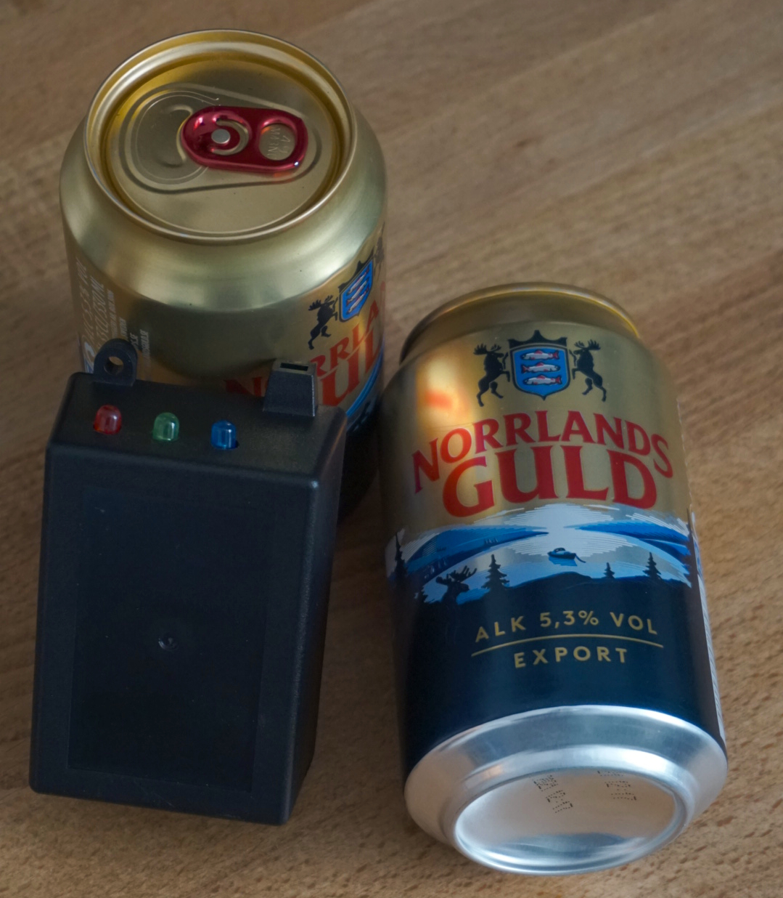

# Digital Drinklist

## Hardware



### Components

* Arduino Nano
* Micro SD Card reader
* 4GB Micro SD card
* RFID-RC522
* 3x Indicator LED's (Red, Green, Blue)
* 3x 330 ohm resistors
* 1x 220 ohm resistor

## Software

### Arduino

Arduino C++ code that listens for RFID cards and checks their ID against
the database of users on the SD card. When a registered user scans their card
enter their name in the `DRINKS.TXT` document on the SD Card.

### Java

Java program with a GUI to use the `DRINKS.TXT` file to generate a summary of
all the logged drinks and present them in a readable way.

## SD Card File structure

The SD Card contains two important files, `DRINKS.TXT` and `USERS.TXT`.

`USERS.TXT` contains all the registered users that are able to use the digital
drinklist, each user is represented by their own line in the `USERS.TXT` file,
formatted as `{userId}:{userName}`. Example: `12345:Holger`

`DRINKS.TXT` contains all the logged drinks where each drink registered is
represented by a line in the file. Formatted as `{userName}`. Example of
a `DRINKS.TXT` file where Holger has registered two drinks and Keso one:

```
Holger
Holger
Keso
```

## Board pinout

### Arduino PINS used

| Arduino PIN | Component | SD Reader PIN | RFID PIN | LED        |
| ----------- | --------- | ------------- | -------- | ---------- |
| D2          | 330 ohm   |               |          | GREEN\_LED |
| D3          | 330 ohm   |               |          | RED\_LED   |
| D4          |           | CS            |          |            |
| D5          | 330 ohm   |               |          | BLUE\_LED  |
| D8          |           |               | SDA      |            |
| D9          |           |               | RST      |            |
| D11         |           | MOSI          | MOSI     |            |
| D12         | 220 ohm   | MISO          |          |            |
| D12         |           |               | MISO     |            |
| D13         |           | SCK           | SCK      |            |
| GND         |           | GND           | GND      |            |
| 3.3V        |           |               | 3.3V     |            |
| 5V          |           | VCC           |          |            |

### LED's

* GREEN\_LED: PIN D2 -> 330 ohm resistor -> long leg -> short leg -> ground
* RED\_LED: PIN D3 -> 330 ohm resistor -> long leg -> short leg -> ground
* BLUE\_LED: PIN D5 -> 330 ohm resistor -> long leg -> short leg -> ground

### SD Card Reader

| SD Reader PIN | Component | Arduino PIN |
| ------------- | --------- | ----------- |
| GND           |           | GND         |
| VCC           |           | 5V          |
| MISO          | 220 ohm   | D12         |
| MOSI          |           | D11         |
| SCK           |           | D13         |
| CS            |           | D4          |

### RFID Reader

| RFID PIN | Arduino PIN |
| -------- | ----------- |
| SDA      | D8          |
| SCK      | D13         |
| MOSI     | D11         |
| MISO     | D12         |
| IRQ      |             |
| GND      | GND         |
| RST      | D9          |
| 3.3V     | 3.3V        |
